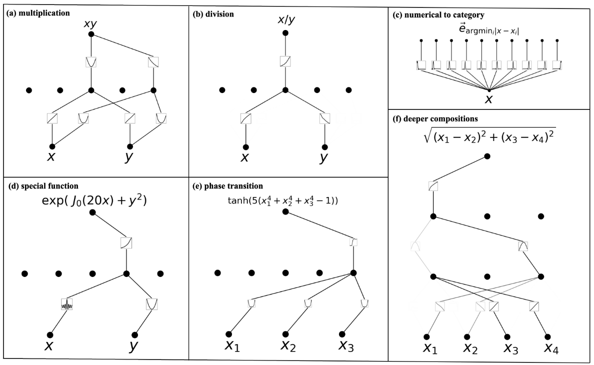

# Rusty-KAN

Kolmogorov-Arnold Networks are a type of neural network that is based on the [Kolmogorov-Arnold representation theorem](https://en.wikipedia.org/wiki/Kolmogorov%E2%80%93Arnold_representation_theorem). Essentially, it states that any continuous function can be represented as a composition of a finite number of univariate functions.

Therefore, a KAN is a neural network where the activation functions are placed on the edges and act as learnable weights for the network. The nodes simply sum the incoming activations.

For example, see the following image, which shows how functions are composed in a KAN to approximate continuous functions:

This is the basis of the Rusty-KAN library, which is a Rust implementation of the KAN algorithm.
